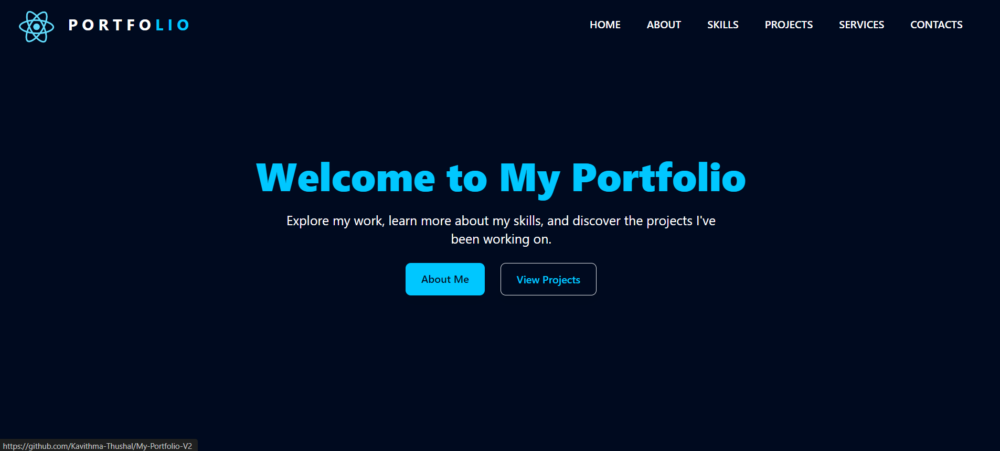

# 🌟 My Portfolio V2 🌟

Discover a meticulously crafted representation of my professional journey, skills, and achievements in the form of My
Portfolio V2. This dynamic showcase encapsulates my best work, offering a comprehensive view of my capabilities and
growth over time. It serves as a powerful tool to communicate my expertise, style, and potential value to prospective
opportunities.

This isn't just a static collection of achievements—it's a dynamic narrative that evolves with my ongoing progress and
new endeavors. My portfolio demonstrates dedication, creativity, and a unique perspective within my chosen field.

Step into a world of limitless possibilities and experience the power of code in action. My Portfolio V2 is more than a
website; it's an immersive journey through my professional story, highlighting the fusion of technology, creativity, and
ambition.

Explore, engage, and witness the convergence of skill and innovation firsthand. Join me as I navigate through the realms
of technology, leaving a trail of ingenuity and excellence behind.

Let's embark on this digital adventure together—where each click unveils a new chapter in the saga of innovation and
creativity.

## 🛠️ Technologies

✅ **React** 
✅ **Vite** 
✅ **Tailwind CSS** 

## 🚀 Features

✅ **Responsive Design**: Ensures optimal viewing experience across various devices and screen sizes. 
✅ **Dynamic Content**: Content is dynamically rendered, making it easy to update and maintain. 
✅ **Project Showcase**: Display your projects with detailed descriptions and links. 
✅ **Skill Highlight**: Showcase your skills and expertise with visually appealing design. 
✅ **Contact Form**: Allow visitors to get in touch with you easily via a contact form. 
✅ **Smooth Navigation**: Smooth scrolling and intuitive navigation for seamless user experience. 

## 📸 Screenshots

### Home

## 📝 Version

**2.0.0**

## 📬 Get in Touch

Got any bugs, issues, or need help understanding the code? Feel free to reach out!

📧 [kavithmathushal9007@gmail.com](mailto:kavithmathushal9007@gmail.com)

#### This project is licensed under the [Apache License](LICENSE)

#### © 2024 All Rights Reserved | Designed by [Kavithma Thushal](https://github.com/Kavithma-Thushal)

#### ‍⚠️👷‍♂️ This Web Site is currently Under Construction. Stay tuned for updates! 👷‍♂️⚠️

